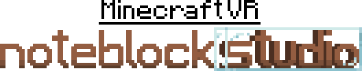

<<<<<<< HEAD
---
description: The official repo Readme.md
---

# Open-NBS-VR

The official repository for OpenNoteBlockStudioVR!

Welcome to the plaza! we hope that you will like this place!

We are currently in the process of constructing buildings At the moment!

you can check out the development progress with this progress bar that we quickly put together.

[----------------------------------] for now it's empty as the work we have is not good enough for putting into the progress bar.

***

links to all the repos that have helped make this, discord links, for all the servers that have helped out, and for the home place that created this, and for the helpers and devs that have contributed to this project

syembol: https://github.com/Syembol Charlie{me}: https://github.com/charlie-sans

## the official OpenNoteBlockStudio Discord: https://discord.gg/w35BqQp

If you want to assist development of this DAW. you can join the discord using the link in the Links section of the readme
=======
# Open Noteblock Studio VR

<figure><figcaption></figcaption></figure>

This project is in beta so nothing is permanent right now and some features might be missing/incomplete.\
\
Our wonderful helpers will try their best to get everything sorted as the project progresses.\
\
The pages on the left will help you traverse the documentation.

If you want to help out you can join the discord using this link. The project information is in the "opennbs-forum" channel, the title is "OpenNoteBlockStudoVR Edition".



## Credits

[Charlie](https://github.com/charlie-sans) - Project leader

[Syembol](https://github.com/Syembol) - Lead pixelart and sprite dev

[Beatzoid](https://github.com/Beatzoid) - Documentation and Github manager
>>>>>>> 153b207879ca1abdf54a82c969053d5b3c0e5da4
